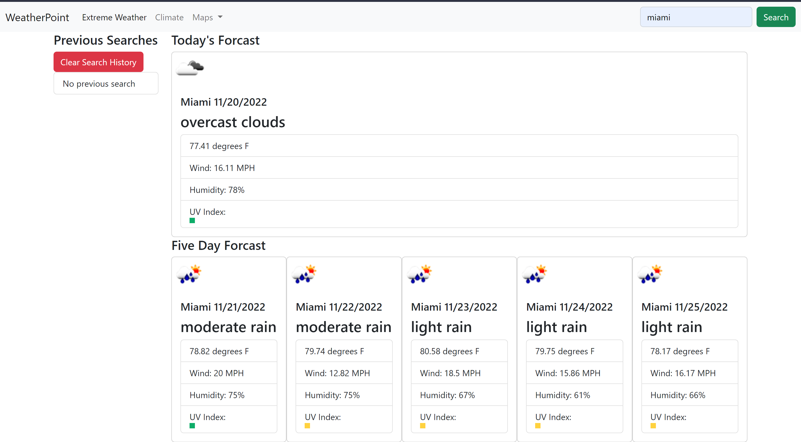

  # Weather Dashboard

  

  ## Table of Contents

  [Author](#author)  
  [Contact](#contact-me)  
  [Deployed Page](#deployed-page)  
  [GitHub Repo](#github-repo)  
  [Project Description](#project-description) 
  [Video Walkthrough](#video-walkthrough) 
  [Installation](#installation) 
  [Usage](#usage) 
  [Test Instructions](#testing) 
  [Contribution Guidelines](#contribution) 
  [Preview Image](#preview-image) 
  [Questions](#questions) 
 

  ## Author

  Alex Mayberry

  ## Contact Me

  **Github:** [alexmayberry](https://github.io/alexmayberry)

  **Email:** alexclimbs@gmail.com

  **Website:** alexmayberry.net

  ## Deployed Page
  
  https://alexmayberry.github.io/weather-app/

  ## GitHub Repo

  [Weather Dashboard](https://github.io/alexmayberry/weather-app)

  ## Project Description

  A simple weather dashboard using the openweather API, bootstrap, jQuery, and jsday.

  ## Video Walkthrough

  [Video Walkthrough](n/a)

  ## Installation

  clone down the repo and run `npm i`

  ## Usage

  run a local server or click on my live link, search a city name and quickly get a simple forecast and 5 day forcast

  ## Testing

  n/a

  ## Contribution

  jump in!

  ## Preview Image

  

  ## Questions

  hmu!